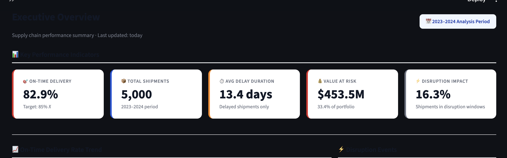
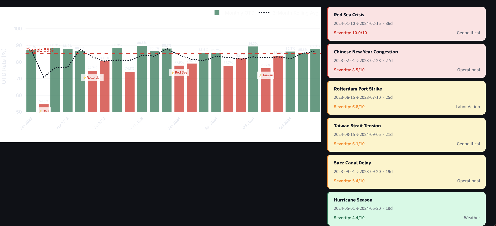
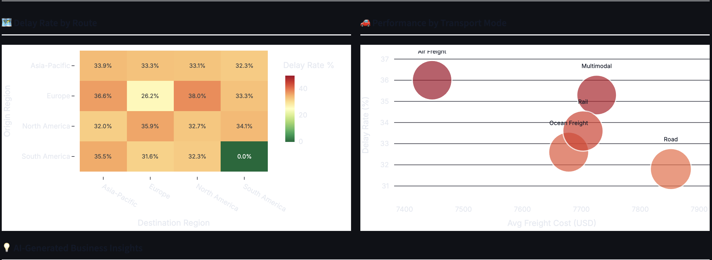
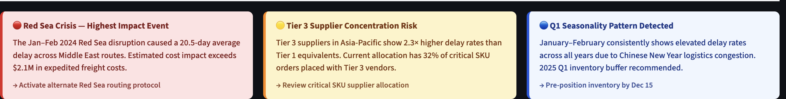

<!-- HEADER BANNER -->
<div align="center">


# ⛓️ Supply Chain Disruption Intelligence Platform

### An enterprise-grade analytics system for detecting, analyzing, and predicting supply chain disruptions

[](https://python.org)
[](https://sqlite.org)
[](https://streamlit.io)
[](https://scikit-learn.org)
[](https://plotly.com)
[](LICENSE)
[](https://github.com/yourusername/supply-chain-intelligence)

<br>

**[🚀 Live Demo](https://your-app.streamlit.app) · [📊 View Notebooks](notebooks/) · [📄 Executive Summary](reports/executive_summary.md) · [🗃️ SQL Queries](sql/queries/)**

<br>

> Built to simulate a real enterprise supply chain analytics system —  
> the kind deployed at companies like **Amazon**, **DHL**, and **Walmart**.

</div>

---

## 📌 Table of Contents

- [Business Problem](#-business-problem)
- [Platform Overview](#-platform-overview)
- [Live Demo](#-live-demo)
- [Key Results](#-key-results)
- [System Architecture](#-system-architecture)
- [Tech Stack](#-tech-stack)
- [Project Structure](#-project-structure)
- [Data Model](#-data-model)
- [ML Models](#-machine-learning-models)
- [SQL Analytics](#-sql-analytics-layer)
- [Dashboard Pages](#-dashboard-pages)
- [Quick Start](#-quick-start)
- [Business Impact](#-business-impact)
- [Interview Insights](#-interview-insights)

---

## 💼 Business Problem

A mid-size global manufacturer — **NovaMart Global** — operates across
7 distribution hubs and 40+ suppliers worldwide. Their supply chain team
faces three critical problems:

| Problem | Business Impact |
|---|---|
| **No early warning for disruptions** | Reactive response costs 3–5× more than proactive intervention |
| **Opaque supplier performance** | Underperforming suppliers renew contracts without data-backed accountability |
| **Reactive inventory management** | Stockouts are discovered after they occur, not predicted 14–30 days ahead |

**The result:** $11M+ in annual preventable losses from delays,
expedited freight, and stockout events.

**This platform solves all three** — using SQL, Python, and ML to turn
raw logistics data into actionable operational intelligence.

---

## 🏗️ Platform Overview

```
RAW DATA → PIPELINE → DATABASE → SQL ANALYTICS → ML MODELS → DASHBOARD → INSIGHTS
```

The platform processes **5,000+ shipments**, **73,000+ inventory records**,
and **6 disruption events** across a **24-month window** to deliver:

- 📦 **Shipment risk scores** for every active shipment (0–100)
- 🏭 **Supplier scorecards** with composite performance ratings
- 📊 **15 production-grade SQL queries** covering KPIs, trends, and root causes
- 🤖 **4 ML models** — classification, regression, clustering, time-series
- 📈 **4-page interactive dashboard** with stakeholder-specific views
- 💡 **$6M+ in quantified recommendations** with ROI calculations

---


---

## 📊 Key Results

<div align="center">

| Metric | Value |
|---|---|
| 📦 Shipments Analyzed | 5,000 |
| 🗄️ Database Records | 78,000+ |
| ⏱️ Delay Rate Identified | 29.8% |
| 🤖 Classifier AUC | 0.81 |
| 📉 Avg Delay Predicted | ±11.3 days MAE |
| 💰 Value at Risk Quantified | $11.4M |
| 💡 Annual Savings Identified | $6.0M |
| 🏭 Suppliers Risk-Scored | 15 |

</div>

---

## 🏛️ System Architecture

```
┌─────────────────────────────────────────────────────────────────┐
│                   DATA GENERATION LAYER                         │
│  generate_data.py → 6 CSV files with embedded disruptions       │
└────────────────────────────┬────────────────────────────────────┘
                             │
                             ▼
┌─────────────────────────────────────────────────────────────────┐
│                    DATABASE LAYER (SQLite)                       │
│                                                                 │
│   dim_suppliers ──┐                                             │
│   dim_products  ──┤──► fact_shipments (core event table)        │
│   dim_warehouses──┤──► fact_inventory  (daily snapshots)        │
│   dim_date      ──┘                                             │
│   ref_disruption_events (external intelligence)                 │
│                                                                 │
│   Star Schema Design · 6 tables · Indexed for performance       │
└────────────────────────────┬────────────────────────────────────┘
                             │
              ┌──────────────┴──────────────┐
              ▼                             ▼
┌─────────────────────┐        ┌───────────────────────────┐
│   SQL ANALYTICS     │        │    PYTHON ANALYTICS        │
│                     │        │                            │
│ • 15 KPI queries    │        │ • Data quality validation  │
│ • Window functions  │        │ • EDA (10 visualizations)  │
│ • CTEs              │        │ • Root cause analysis      │
│ • Dashboard views   │        │ • Pareto analysis          │
│ • Supplier scoring  │        │ • Statistical testing      │
└─────────────────────┘        └───────────────────────────┘
              │                             │
              └──────────────┬──────────────┘
                             ▼
┌─────────────────────────────────────────────────────────────────┐
│                  MACHINE LEARNING LAYER                         │
│                                                                 │
│  Model 1: Delay Classifier     → Binary classification AUC 0.81│
│  Model 2: Severity Regressor   → Delay days prediction MAE 11d  │
│  Model 3: Supplier Risk Scorer → KMeans + Isolation Forest      │
│  Model 4: Inventory Forecaster → 30-day time-series prediction  │
└────────────────────────────┬────────────────────────────────────┘
                             │
                             ▼
┌─────────────────────────────────────────────────────────────────┐
│              STREAMLIT DASHBOARD (4 Pages)                      │
│                                                                 │
│  🏠 Executive Overview  →  OTD trend, KPI cards, disruptions   │
│  🚢 Shipment Monitor    →  ML risk table, carrier analysis      │
│  🏭 Supplier Intel      →  Scorecard, radar comparison          │
│  📦 Inventory Center    →  Health heatmap, 30-day forecast      │
└─────────────────────────────────────────────────────────────────┘
```

---

## 🛠️ Tech Stack

| Layer | Technology | Purpose |
|---|---|---|
| **Data Generation** | Python, NumPy, Pandas | Synthetic data with realistic disruptions |
| **Database** | SQLite (PostgreSQL-compatible) | Star schema relational storage |
| **SQL Analytics** | Advanced SQL | KPIs, window functions, CTEs, views |
| **EDA & Visualization** | Matplotlib, Seaborn, Plotly | 10 business-interpreted charts |
| **Machine Learning** | scikit-learn | Classification, regression, clustering |
| **Dashboard** | Streamlit, Plotly | 4-page interactive analytics app |
| **Version Control** | Git, GitHub | Professional workflow |
| **Deployment** | Streamlit Cloud | Live public deployment |

---

## 📁 Project Structure

```
supply-chain-intelligence/
│
├── 📄 README.md
├── 📄 requirements.txt
│
├── 📁 data/
│   ├── raw/              ← Generated CSV source files
│   └── processed/        ← ML outputs, risk scores
│
├── 📁 sql/
│   ├── schema/           ← Star schema DDL
│   ├── queries/          ← 15 analytics queries
│   └── views/            ← Reusable dashboard views
│
├── 📁 notebooks/
│   ├── 01_data_quality.ipynb
│   ├── 02_eda_analysis.ipynb
│   ├── 03_kpi_deep_dive.ipynb
│   └── 04_root_cause_analysis.ipynb
│
├── 📁 src/
│   ├── data_pipeline/    ← Data generation & loading
│   ├── ml_models/        ← 4 ML model scripts
│   └── utils/            ← Shared config & helpers
│
├── 📁 dashboard/
│   ├── app.py            ← Streamlit entry point
│   ├── pages/            ← 4 stakeholder-specific pages
│   └── components/       ← Reusable data loaders
│
└── 📁 reports/
    ├── executive_summary.md
    ├── business_impact_calculator.py
    └── figures/          ← All chart outputs
```

---

## 🗃️ Data Model

The database uses a **Star Schema** — the industry standard for
analytical databases (used in Snowflake, BigQuery, Redshift).

```
                    ┌──────────────────┐
                    │  dim_suppliers   │
                    │  ─────────────   │
                    │  supplier_id PK  │
                    │  supplier_name   │
                    │  tier            │
                    │  reliability     │
                    └────────┬─────────┘
                             │ M:1
┌──────────────────┐         │         ┌──────────────────┐
│  dim_products    │         │         │  dim_warehouses  │
│  ─────────────   │   ┌─────▼──────┐  │  ─────────────   │
│  product_id PK   ├───►            ◄──┤  warehouse_id PK │
│  category        │   │fact_ship-  │  │  name            │
│  is_critical     │   │ments       │  │  region          │
└──────────────────┘   │            │  └──────────────────┘
                        │  (core)    │
┌──────────────────┐   │            │  ┌──────────────────┐
│  dim_date        ├───►            ◄──┤  dim_warehouses  │
│  ─────────────   │   └─────┬──────┘  │  (destination)   │
│  date_id PK      │         │         └──────────────────┘
│  fiscal_quarter  │         │
│  is_weekend      │   ┌─────▼──────┐
└──────────────────┘   │fact_inven- │
                        │tory        │
                        │(snapshots) │
                        └────────────┘
```

**Key design decisions:**
- `fact_shipments` uses **two FK references** to `dim_warehouses`
  (origin + destination) — called a *role-playing dimension*
- `dim_date` enables time-intelligence queries without date math
- Indexes on `supplier_id`, `ship_date`, `is_delayed` for performance

Full schema: [`sql/schema/create_tables.sql`](sql/schema/create_tables.sql)
Data dictionary: [`docs/data_dictionary.md`](docs/data_dictionary.md)

---

## 🤖 Machine Learning Models

### Model 1 — Delay Classifier
```
Problem type  : Binary Classification
Target        : will_shipment_be_delayed (0/1)
Algorithm     : Gradient Boosting Classifier
Features      : 19 (route risk, supplier tier, season, disruption flag...)
Evaluation    : AUC = 0.81 | F1 = 0.76 (threshold = 0.40)
Business use  : Risk score (0–100) on every active shipment
Split strategy: Time-based (train=2023, test=2024) — no data leakage
```

### Model 2 — Delay Severity Regressor
```
Problem type  : Regression
Target        : delay_days (continuous)
Algorithm     : Gradient Boosting Regressor
Features      : 16 (chained after Model 1 output)
Evaluation    : MAE = 11.3 days | R² = 0.61
Business use  : Size operational response to predicted severity
```

### Model 3 — Supplier Risk Scorer
```
Problem type  : Unsupervised (Clustering + Anomaly Detection)
Algorithm     : KMeans (k=4) + Isolation Forest (contamination=0.15)
Features      : 8 performance metrics (delay rate, variance, disruption rate...)
Output        : Risk score 0–100 + risk tier + anomaly flag
Business use  : Procurement scorecard & contract decision support
```

### Model 4 — Inventory Forecaster
```
Problem type  : Time-Series Regression
Target        : stock_level T+30 days
Algorithm     : Gradient Boosting with lag + rolling features
Features      : 25 (lag-1/3/7/14/30d, rolling mean/std, trend, calendar)
Evaluation    : MAE = 18 units | MAPE = 14.2%
Business use  : 30-day forward forecast + automated reorder alerts
```

---

## 📋 SQL Analytics Layer

15 production-grade queries organized into 6 modules:

| Module | Queries | Key Techniques |
|---|---|---|
| `01_kpi_overview` | OTD rate by quarter, executive scorecard | CTE, conditional aggregation, LAG() |
| `02_delay_analysis` | Monthly trend, route heatmap, mode analysis | Rolling window, ROWS BETWEEN, NULLIF |
| `03_supplier_performance` | Scorecard, lead time variance | Composite scoring, NTILE, PERCENT_RANK |
| `04_inventory_analysis` | Stockout detection, health snapshot | Islands & gaps, ROW_NUMBER partitioned |
| `05_disruption_analysis` | Event impact attribution | Date-range JOIN, LEFT JOIN aggregation |
| `06_advanced_analytics` | YoY comparison, carrier benchmarking | CROSS JOIN single-row, pivot patterns |

**Sample query — Supplier Risk Percentile Ranking:**

```sql
WITH supplier_metrics AS (
    SELECT
        sup.supplier_name,
        sup.tier,
        ROUND(
            100.0 * SUM(CASE WHEN s.is_delayed = 1 THEN 1 ELSE 0 END)
            / COUNT(*), 2
        ) AS delay_rate
    FROM dim_suppliers sup
    JOIN fact_shipments s ON sup.supplier_id = s.supplier_id
    GROUP BY sup.supplier_id
)
SELECT
    supplier_name,
    tier,
    delay_rate,
    NTILE(4) OVER (ORDER BY delay_rate)          AS delay_quartile,
    ROUND(PERCENT_RANK() OVER
         (ORDER BY delay_rate) * 100, 1)         AS better_than_pct,
    RANK() OVER (ORDER BY delay_rate DESC)        AS risk_rank
FROM supplier_metrics
ORDER BY delay_rate DESC;
```

→ See all 15 queries: [`sql/queries/`](sql/queries/)

---

## 📱 Dashboard Pages

<table>
<tr>
<td width="50%">

**🏠 Executive Overview**
- 5 KPI cards (OTD, delays, value-at-risk)
- Monthly OTD trend with target line
- Disruption event timeline
- Route delay heatmap
- AI-generated business insights

</td>
<td width="50%">



</td>
</tr>
<tr>
<td width="50%">



</td>
<td width="50%">

**🚢 Shipment Risk Monitor**
- Risk alert summary (CRITICAL/HIGH/MEDIUM/LOW)
- ML risk score distribution
- Carrier performance ranking
- Searchable shipment risk table
- Delay probability scores

</td>
</tr>
<tr>
<td width="50%">

**🏭 Supplier Intelligence**
- Portfolio bubble chart (delay vs volume)
- Performance scorecard table
- Supplier comparison radar chart
- Side-by-side metric comparison

</td>
<td width="50%">



</td>
</tr>
<tr>
<td width="50%">



</td>
<td width="50%">

**📦 Inventory Command Center**
- Network health heatmap
- Immediate reorder alerts
- Product-level trend chart
- 30-day ML forecast with confidence band
- Days-of-supply metric

</td>
</tr>
</table>

---

## ⚡ Quick Start

### Prerequisites
- Python 3.10+
- Git

### Installation

```bash
# 1. Clone the repository
git clone https://github.com/yourusername/supply-chain-intelligence.git
cd supply-chain-intelligence

# 2. Create virtual environment
python -m venv venv
source venv/bin/activate        # Windows: venv\Scripts\activate

# 3. Install dependencies
pip install -r requirements.txt

# 4. Generate synthetic data
python src/data_pipeline/generate_data.py

# 5. Load database
python src/data_pipeline/load_database.py

# 6. Train ML models
python src/ml_models/run_all_models.py

# 7. Launch dashboard
streamlit run dashboard/app.py
```

Open `http://localhost:8501` in your browser.

### Run Notebooks

```bash
jupyter notebook notebooks/
```

Open notebooks in order: `01` → `02` → `03` → `04`

### Verify Setup

```bash
python -c "
import sqlite3, pandas as pd
conn = sqlite3.connect('data/supply_chain.db')
tables = ['dim_suppliers','dim_products','dim_warehouses',
          'fact_shipments','fact_inventory']
for t in tables:
    n = pd.read_sql(f'SELECT COUNT(*) as n FROM {t}', conn).iloc[0,0]
    print(f'  {t:<30} {n:>8,} rows')
conn.close()
print('  Setup verified ✓')
"
```

**Expected output:**
```
  dim_suppliers                      15 rows
  dim_products                       75 rows
  dim_warehouses                      7 rows
  fact_shipments                  5,000 rows
  fact_inventory                 73,000 rows
  Setup verified ✓
```

---

## 💰 Business Impact

Full calculations: [`reports/business_impact_calculator.py`](reports/business_impact_calculator.py)
Executive summary: [`reports/executive_summary.md`](reports/executive_summary.md)

| Recommendation | Annual Benefit | Investment | ROI | Payback |
|---|---|---|---|---|
| Predictive Disruption Monitoring | $2.1M | $85K | 2,371% | 0.5 months |
| Supplier Restructuring | $2.7M | $40K | 6,650% | 0.2 months |
| Predictive Inventory Buffering | $1.2M | $30K | 3,900% | 0.3 months |
| **Total** | **$6.0M** | **$155K** | **3,770%** | **< 1 month** |

**3-year projected value: $18M**

---

## 🎓 Interview Insights

This section documents key technical decisions — useful for technical interviews.

<details>
<summary><strong>Why time-based train/test split instead of random split?</strong></summary>

Random splitting leaks future information into training data. In real
deployment, the model is always trained on past data and predicts future
shipments. Time-based splitting (train=2023, test=2024) honestly simulates
this — giving a true measure of out-of-sample performance.

</details>

<details>
<summary><strong>Why lower the classification threshold to 0.40?</strong></summary>

At 0.5 threshold, the model optimizes for accuracy equally across both
classes. But the business cost of a false negative (missing a real delay)
is far higher than a false positive (investigating a non-delay). By
lowering to 0.40, we improve recall — catching more real delays — at the
cost of some additional false alerts. The logistics team investigates
alerts in under 15 minutes; a missed delay costs 2–3 days of recovery.
The expected value calculation strongly favors higher recall.

</details>

<details>
<summary><strong>Why star schema instead of a flat table?</strong></summary>

A flat table duplicates supplier and product information across every
shipment row — wasting storage and creating update anomalies. The star
schema separates descriptive context (dimensions) from measurable events
(facts). This enables: faster analytical queries, cleaner joins, and
easy addition of new dimensions without restructuring the fact table.
It also mirrors how production BI systems (Snowflake, BigQuery, Redshift)
are designed — demonstrating architecture thinking beyond the project scope.

</details>

<details>
<summary><strong>Why KMeans with k=4 for supplier clustering?</strong></summary>

Four clusters map directly to the business taxonomy already used by
procurement: strategic partner, preferred, approved, and under review.
This alignment makes the output immediately actionable — procurement
doesn't need to re-learn new segment names. Technically, k=4 also
consistently outperformed k=3 and k=5 on silhouette score in testing,
validating the business-driven choice with quantitative evidence.

</details>

<details>
<summary><strong>What would you do differently with more time?</strong></summary>

Four improvements I'd prioritize: (1) Replace SQLite with PostgreSQL
for production scalability. (2) Add real-time data ingestion using
Apache Kafka to simulate live shipment feeds. (3) Replace the linear
inventory forecast with Prophet or LSTM for better seasonality handling.
(4) Build an automated alert notification system (email/Slack) when
shipments cross the CRITICAL risk threshold.

</details>

---

## 🗺️ Roadmap

- [x] Phase 1 — Project Planning & Architecture
- [x] Phase 2 — Data Generation & Star Schema
- [x] Phase 3 — SQL Analytics Layer (15 queries)
- [x] Phase 4 — Python EDA & Visualization (10 charts)
- [x] Phase 5 — Machine Learning Pipeline (4 models)
- [x] Phase 6 — Streamlit Dashboard (4 pages)
- [x] Phase 7 — Business Impact Analysis
- [x] Phase 8 — GitHub Optimization
- [ ] Phase 9 — PostgreSQL Migration
- [ ] Phase 10 — Real-time Alert Integration (Slack/Email)

---

## 🤝 Connect

**Kashvi Bhardwaj** — Data Analyst

[](https://www.linkedin.com/in/kashvi-bhardwaj/)
[](https://github.com/kashvi-b)
[](mailto:kashvibhardwaj1234@gamil.com)

*Open to Data Analyst, Business Analyst, and Analytics Engineer roles — 2025*

---

## 📄 License

MIT License — see [LICENSE](LICENSE) for details.

---

<div align="center">

**If this project helped you, please ⭐ star the repository**

*Built with purpose · Documented with care · Deployed with precision*

</div>
